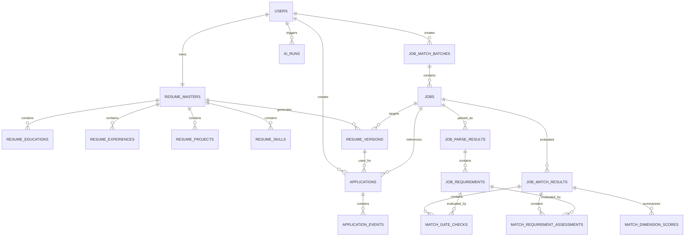

# CareerPilot MVP 0.1 Database Specification

**建议文件：** `docs/DATABASE.md`  
**数据库：** PostgreSQL  
**ORM：** SQLAlchemy 2.x  
**Migration：** Alembic

---

# 1. 设计原则

数据库设计遵循：

1. 用户原始输入与 AI 派生数据分离；
2. 简历母版与岗位版简历分离；
3. 原始 JD 永久保留；
4. AI 分析结果必须可追溯至：
   - 使用的简历；
   - 使用的 JD；
   - Prompt 版本；
   - 模型版本；
5. AI 分析允许重新生成，不覆盖历史结果；
6. 招聘流程不采用固定流水线；
7. 所有业务数据必须归属于具体 User；
8. 结构化核心字段优先关系表，灵活 AI 输出允许 JSONB；
9. 历史投递不能因为 Job 或简历后来修改而失去上下文。

---

# 2. 通用约定

## 2.1 主键

所有业务表：

```text
id UUID PRIMARY KEY
```

由应用层：

```python
uuid.uuid4()
```

生成。

---

## 2.2 时间

数据库全部使用：

```text
TIMESTAMPTZ
```

统一存 UTC。

字段：

```text
created_at
updated_at
```

默认：

```sql
NOW()
```

前端按用户时区转换。

---

## 2.3 Enum

推荐 PostgreSQL Enum 或 SQLAlchemy Enum。

### ExperienceType

```text
WORK
INTERNSHIP
CAMPUS
OTHER
```

### BatchStatus

```text
DRAFT
PROCESSING
COMPLETED
PARTIAL_FAILED
FAILED
```

### AIStatus

```text
PENDING
PROCESSING
SUCCESS
FAILED
```

### RequirementType

```text
HARD
CORE
STANDARD
PREFERRED
```

### MatchDimension

```text
RESPONSIBILITY
TOOLS_METHODS
BUSINESS_DOMAIN
OWNERSHIP
OUTCOME
COMMUNICATION
```

### EligibilityStatus

```text
PASS
WARN
FAIL
```

### EvidenceGrade

```text
A
B
C
X
```

### ApplicationStage

```text
APPLICATION
RESUME_SCREEN
ASSESSMENT
WRITTEN_TEST
AI_INTERVIEW
INTERVIEW
OFFER
OTHER
```

### ApplicationStatus

```text
ACTIVE
REJECTED
OFFER
WITHDRAWN
```

---

# 3. ERD



---

# 4. users

```text
users
```

| 字段 | 类型 | 约束 |
|---|---|---|
| id | UUID | PK |
| email | VARCHAR(320) | UNIQUE, NOT NULL |
| password_hash | VARCHAR(255) | NOT NULL |
| name | VARCHAR(100) | NULL |
| created_at | TIMESTAMPTZ | NOT NULL |
| updated_at | TIMESTAMPTZ | NOT NULL |

索引：

```sql
UNIQUE INDEX users_email_idx ON users(email);
```

保存 email 前：

```text
trim
lowercase
```

---

# 5. resume_masters

一个 User 最多一个母版。

| 字段 | 类型 | 约束 |
|---|---|---|
| id | UUID | PK |
| user_id | UUID | FK users, UNIQUE |
| name | VARCHAR(100) | NULL |
| phone | VARCHAR(50) | NULL |
| email | VARCHAR(320) | NULL |
| city | VARCHAR(100) | NULL |
| job_status | VARCHAR(100) | NULL |
| summary | TEXT | NULL |
| created_at | TIMESTAMPTZ | |
| updated_at | TIMESTAMPTZ | |

约束：

```sql
UNIQUE(user_id)
```

注意：

`users.email`

是账号邮箱。

`resume_masters.email`

是简历联系方式。

两者不能强制相同。

---

# 6. resume_educations

| 字段 | 类型 |
|---|---|
| id | UUID |
| resume_master_id | UUID |
| school | VARCHAR(200) |
| degree | VARCHAR(100) |
| major | VARCHAR(200) |
| start_date | DATE |
| end_date | DATE |
| gpa | VARCHAR(50) NULL |
| courses | TEXT NULL |
| description | TEXT NULL |
| sort_order | INTEGER |
| created_at | TIMESTAMPTZ |
| updated_at | TIMESTAMPTZ |

FK：

```text
resume_master_id
→ resume_masters.id
ON DELETE CASCADE
```

---

# 7. resume_experiences

| 字段 | 类型 |
|---|---|
| id | UUID |
| resume_master_id | UUID |
| experience_type | ENUM |
| organization | VARCHAR(200) |
| position | VARCHAR(200) |
| start_date | DATE |
| end_date | DATE NULL |
| is_current | BOOLEAN DEFAULT FALSE |
| description | TEXT |
| achievements | TEXT NULL |
| sort_order | INTEGER |
| created_at | TIMESTAMPTZ |
| updated_at | TIMESTAMPTZ |

必须保留用户原始表达。

AI 润色内容不得写回该表。

---

# 8. resume_projects

| 字段 | 类型 |
|---|---|
| id | UUID |
| resume_master_id | UUID |
| name | VARCHAR(200) |
| role | VARCHAR(200) NULL |
| start_date | DATE NULL |
| end_date | DATE NULL |
| background | TEXT NULL |
| description | TEXT |
| achievements | TEXT NULL |
| sort_order | INTEGER |
| created_at | TIMESTAMPTZ |
| updated_at | TIMESTAMPTZ |

---

# 9. resume_skills

| 字段 | 类型 |
|---|---|
| id | UUID |
| resume_master_id | UUID |
| skill_name | VARCHAR(150) |
| skill_category | VARCHAR(100) NULL |
| proficiency | VARCHAR(50) NULL |
| sort_order | INTEGER |
| created_at | TIMESTAMPTZ |
| updated_at | TIMESTAMPTZ |

约束建议：

```sql
UNIQUE(resume_master_id, skill_name)
```

---

# 10. job_match_batches

表示一次职位比较任务。

例如：

```text
腾讯 5 个运营岗比较
```

| 字段 | 类型 |
|---|---|
| id | UUID |
| user_id | UUID |
| name | VARCHAR(200) NULL |
| status | BatchStatus |
| total_jobs | INTEGER |
| successful_jobs | INTEGER DEFAULT 0 |
| failed_jobs | INTEGER DEFAULT 0 |
| created_at | TIMESTAMPTZ |
| updated_at | TIMESTAMPTZ |

索引：

```text
(user_id, created_at DESC)
```

---

# 11. jobs

保存用户输入的原始职位。

| 字段 | 类型 |
|---|---|
| id | UUID |
| batch_id | UUID |
| user_id | UUID |
| company_name | VARCHAR(200) |
| title | VARCHAR(300) |
| location | VARCHAR(200) NULL |
| department | VARCHAR(200) NULL |
| source_url | TEXT NULL |
| raw_jd | TEXT |
| created_at | TIMESTAMPTZ |
| updated_at | TIMESTAMPTZ |

必须保留：

```text
raw_jd
```

AI 永远不能覆盖。

---

# 12. job_parse_results

每次 Job Parser 调用产生一条记录。

因此同一 Job 可以被不同 Prompt 重新解析。

| 字段 | 类型 |
|---|---|
| id | UUID |
| job_id | UUID |
| ai_run_id | UUID NULL |
| status | AIStatus |
| summary | TEXT NULL |
| prompt_version | VARCHAR(50) |
| model | VARCHAR(100) |
| error_code | VARCHAR(100) NULL |
| created_at | TIMESTAMPTZ |

关系：

```text
Job 1:N JobParseResult
```

查询职位时默认读取：

```text
最新 SUCCESS ParseResult
```

---

# 13. job_requirements

这是职位匹配系统最重要的数据表之一。

一个 JD 会被拆成多个：

> Atomic Requirement

例如：

```text
R1 独立负责用户运营策略制定
R2 通过数据分析发现用户问题
R3 熟练使用SQL
R4 有互联网行业经验优先
```

字段：

| 字段 | 类型 |
|---|---|
| id | UUID |
| job_parse_result_id | UUID |
| requirement_type | RequirementType |
| dimension | MatchDimension NULL |
| requirement_text | TEXT |
| source_quote | TEXT |
| importance | SMALLINT |
| sort_order | INTEGER |
| created_at | TIMESTAMPTZ |

`importance`：

```text
1 = 普通要求
2 = JD明确重点
```

`sort_order` 从 1 开始，并与 `job_parser_v1` 的 `R1...Rn` 对应；同一解析结果中
不得重复。读取时可确定性重建 `requirement_key`，无需把模型临时 Key 作为第二套
业务标识保存。

Hard Requirement：

```text
dimension = NULL
```

因为 Hard Gate 不参与能力评分。

---

# 14. job_match_results

每次：

```text
Resume Snapshot
×
Job Parse Result
```

产生一条 MatchResult。

| 字段 | 类型 |
|---|---|
| id | UUID |
| user_id | UUID |
| job_id | UUID |
| resume_master_id | UUID |
| job_parse_result_id | UUID |
| ai_run_id | UUID NULL |
| eligibility_status | EligibilityStatus |
| total_score | NUMERIC(5,2) |
| confidence_score | NUMERIC(5,2) |
| confidence_level | VARCHAR(20) |
| recommendation_level | VARCHAR(30) |
| recommendation | TEXT |
| strengths | JSONB |
| gaps | JSONB |
| resume_snapshot | JSONB |
| job_snapshot | JSONB |
| prompt_version | VARCHAR(50) |
| model | VARCHAR(100) |
| created_at | TIMESTAMPTZ |

数据库使用复合外键保证：

```text
MatchResult.user_id = Job.user_id = ResumeMaster.user_id
MatchResult.job_id = JobParseResult.job_id
```

因此即使业务层出现错误，也不能把其他用户的简历或其他职位的解析结果关联到
当前 Match Result。

不要 UPDATE 历史分析。

用户点击：

```text
重新分析
```

创建新 MatchResult。

---

# 15. match_gate_checks

专门保存硬门槛判断。

| 字段 | 类型 |
|---|---|
| id | UUID |
| match_result_id | UUID |
| job_requirement_id | UUID |
| status | EligibilityStatus |
| reason | TEXT |
| resume_evidence | JSONB |
| created_at | TIMESTAMPTZ |

例如：

```text
毕业年份：FAIL

JD：
2026届毕业生

Resume：
2027-06毕业
```

---

# 16. match_requirement_assessments

这是 AI Job Matcher 的主要落库对象。

每个非 Hard Requirement 对应一条。

| 字段 | 类型 |
|---|---|
| id | UUID |
| match_result_id | UUID |
| job_requirement_id | UUID |
| match_level | SMALLINT |
| evidence_grade | EvidenceGrade |
| evidence_cap | SMALLINT |
| weighted_score | NUMERIC(6,3) |
| assessment_status | VARCHAR(30) |
| reason | TEXT |
| resume_evidence | JSONB |
| created_at | TIMESTAMPTZ |

`match_level`：

```text
0–4
```

`evidence_cap`：

由后端根据证据等级生成：

```text
A → 4
B → 3
C → 1
X → 0
```

`assessment_status`：

```text
MATCHED
PARTIAL
CONFIRMED_GAP
UNKNOWN
```

---

# 17. match_dimension_scores

用于前端快速读取雷达图 / 分项分数。

| 字段 | 类型 |
|---|---|
| id | UUID |
| match_result_id | UUID |
| dimension | MatchDimension |
| raw_score | NUMERIC |
| max_score | NUMERIC |
| normalized_score | NUMERIC |
| created_at | TIMESTAMPTZ |

固定维度满分：

```text
RESPONSIBILITY   35
TOOLS_METHODS    20
BUSINESS_DOMAIN  15
OWNERSHIP        15
OUTCOME          10
COMMUNICATION     5
```

合计：

```text
100
```

---

# 18. 评分计算

AI 不计算最终得分。

AI 只输出：

```text
Requirement
→ Match Level M
→ Evidence Grade
```

后端：

```python
EVIDENCE_CAP = {
    "A": 4,
    "B": 3,
    "C": 1,
    "X": 0,
}
```

每项：

```text
effective_level
=
min(match_level, evidence_cap)
```

某维度内部：

```text
requirement_weight
=
importance
/
该维度所有 requirement importance 总和
```

单项：

```text
item_score
=
dimension_max
× requirement_weight
× effective_level / 4
```

维度：

```text
dimension_score
=
Σ item_score
```

总分：

```text
total_score
=
Σ dimension_score
```

因此模型永远无法：

```text
“感觉这个人不错，给92”
```

---

# 19. 没有某维度要求时

例如某 JD 完全没有：

```text
COMMUNICATION
```

则不能简单记：

```text
0 / 5
```

应：

```text
N/A
```

剩余适用维度按比例重新归一至：

```text
100
```

后端负责完成。具体规则：

```python
active_base_max = sum(DIMENSION_MAX[d] for d in active_dimensions)

effective_dimension_max = (
    DIMENSION_MAX[dimension]
    / active_base_max
    * 100
)
```

数据库只保存适用维度的 `MatchDimensionScore`。其中 `max_score` 保存重新归一后的
`effective_dimension_max`，因此适用维度的 `max_score` 合计为 100，`raw_score`
合计与 `JobMatchResult.total_score` 保持同一口径。未出现的维度不保存 0 分行。

---

# 20. Confidence

不把 Confidence 理解为：

> 这个人有 83% 概率匹配。

它只是：

> 当前评分有多少职位要求得到了足够明确的简历证据支持。

建议：

```text
Evidence A/B → 1
Evidence C → 0.5
Evidence X → 0
```

按 Requirement 权重求加权覆盖率。

得到：

```text
confidence_score 0–100
```

等级：

```text
>=85 HIGH
60–84 MEDIUM
<60 LOW
```

如果存在：

```text
未知 Hard Gate
```

则：

```text
最高只能 MEDIUM
```

如果存在多个未知核心要求：

可降为 LOW。

---

# 21. Recommendation

建议由后端生成基础等级：

```text
85–100 PRIORITY
75–84  STRONG
65–74  SELECTIVE
<65    LOW
```

`total_score` 以两位小数保存并用于精确排序；推荐等级先采用 `ROUND_HALF_UP`
四舍五入为页面展示整数，再按上述整数边界分档。例如 `84.50` 展示为 `85`，对应
`PRIORITY`，避免页面显示分数与推荐等级不一致。

Eligibility：

```text
FAIL
```

强制：

```text
BLOCKED
```

即使：

```text
score = 93
```

也只能展示：

> 能力匹配较高，但存在明确硬性条件冲突。

---

# 22. resume_versions

保存针对性简历。

| 字段 | 类型 |
|---|---|
| id | UUID |
| user_id | UUID |
| resume_master_id | UUID |
| job_id | UUID |
| match_result_id | UUID NULL |
| name | VARCHAR(255) |
| status | VARCHAR(20) |
| content | JSONB |
| source_resume_snapshot | JSONB |
| source_job_snapshot | JSONB |
| prompt_version | VARCHAR(50) |
| model | VARCHAR(100) |
| created_at | TIMESTAMPTZ |
| updated_at | TIMESTAMPTZ |

status：

```text
DRAFT
SAVED
```

AI 生成：

```text
DRAFT
```

用户点击：

```text
保存岗位版简历
```

变成：

```text
SAVED
```

---

# 23. Resume Version content

建议统一结构：

```json
{
  "summary": "...",

  "education": [],

  "experiences": [
    {
      "source_id": "...",
      "organization": "...",
      "position": "...",
      "start_date": "...",
      "end_date": "...",
      "bullets": []
    }
  ],

  "projects": [],

  "skills": []
}
```

其中不可变字段由 Backend 从母版 Snapshot 合并。

AI 不直接生成：

```text
organization
position
dates
school
degree
```

---

# 24. applications

| 字段 | 类型 |
|---|---|
| id | UUID |
| user_id | UUID |
| job_id | UUID NULL |
| resume_version_id | UUID NULL |
| company_name | VARCHAR(200) |
| job_title | VARCHAR(300) |
| job_url | TEXT NULL |
| applied_at | TIMESTAMPTZ |
| current_stage | ApplicationStage |
| current_round | SMALLINT NULL |
| process_status | ApplicationStatus |
| note | TEXT NULL |
| created_at | TIMESTAMPTZ |
| updated_at | TIMESTAMPTZ |

即使 `job_id` 后续不存在：

仍保留：

```text
company_name
job_title
job_url
```

作为历史 Snapshot。

---

# 25. application_events

| 字段 | 类型 |
|---|---|
| id | UUID |
| application_id | UUID |
| event_type | ApplicationStage |
| custom_event_name | VARCHAR(200) NULL |
| round_no | SMALLINT NULL |
| occurred_at | TIMESTAMPTZ |
| outcome | VARCHAR(30) NULL |
| note | TEXT NULL |
| created_at | TIMESTAMPTZ |
| updated_at | TIMESTAMPTZ |

推荐 outcome：

```text
PENDING
PASSED
FAILED
COMPLETED
CANCELLED
```

---

# 26. ai_runs

建议 MVP 就建立，用于成本与故障追踪。

| 字段 | 类型 |
|---|---|
| id | UUID |
| user_id | UUID |
| skill_name | VARCHAR(100) |
| prompt_version | VARCHAR(50) |
| model | VARCHAR(100) |
| status | AIStatus |
| request_id | VARCHAR(200) NULL |
| input_hash | VARCHAR(64) NULL |
| latency_ms | INTEGER NULL |
| input_tokens | INTEGER NULL |
| output_tokens | INTEGER NULL |
| error_code | VARCHAR(100) NULL |
| created_at | TIMESTAMPTZ |

禁止保存：

```text
完整简历
手机号
邮箱
完整AI Prompt
```

到日志表。

---

# 27. 删除策略

## User 删除

```text
CASCADE
```

删除用户所有数据。

## Resume Master

对子项目：

```text
CASCADE
```

但产品层面：

存在 Application 后不建议允许直接删除母版。

## Job Batch

可删除。

对应 Jobs：

```text
CASCADE
```

Application：

```text
job_id ON DELETE SET NULL
```

因为历史申请必须保留。

## Resume Version

Application：

```text
resume_version_id ON DELETE SET NULL
```

---

# 28. 必要索引

```sql
users(email)

resume_masters(user_id)

resume_educations(resume_master_id)
resume_experiences(resume_master_id)
resume_projects(resume_master_id)
resume_skills(resume_master_id)

job_match_batches(user_id, created_at DESC)

jobs(batch_id)
jobs(user_id)

job_parse_results(job_id, created_at DESC)

job_requirements(job_parse_result_id)

job_match_results(job_id, created_at DESC)
job_match_results(user_id, created_at DESC)

match_gate_checks(match_result_id)
match_requirement_assessments(match_result_id)
match_dimension_scores(match_result_id)

resume_versions(user_id, created_at DESC)
resume_versions(job_id)

applications(user_id, process_status)
applications(user_id, updated_at DESC)

application_events(application_id, occurred_at)

ai_runs(user_id, created_at DESC)
```

---

# 29. Transaction 边界

以下操作必须使用 Transaction。

## 保存简历母版

```text
ResumeMaster
+
Education
+
Experience
+
Project
+
Skill
```

任一失败：

```text
ROLLBACK
```

---

## 创建 Match Batch

```text
Batch
+
Jobs
```

一起创建。

---

## 保存单个 Match Result

```text
MatchResult
+
GateChecks
+
RequirementAssessments
+
DimensionScores
```

一个 Job 内事务一致。

不同 Job 不共用事务。

因此：

```text
5个Job
4成功
1失败
```

允许保存 4 个。

---

## 创建 Application

```text
Application
+
第一个 APPLICATION Event
```

必须同时成功。

---

# 30. Alembic Migration 顺序

推荐：

```text
001_create_users

002_create_resume_master

003_create_resume_sections

004_create_job_batches_jobs

005_create_job_parse_tables

006_create_job_match_tables

007_create_resume_versions

008_create_applications

009_create_ai_runs

010_add_indexes
```

---

# 31. ORM 模块结构

```text
models/
├── user.py
├── resume.py
├── job.py
├── matching.py
├── resume_version.py
├── application.py
└── ai_run.py
```

不要：

```text
models.py
```

一个文件写全部模型。

---

# 32. MVP 数据库验收

开发完成后必须通过：

### Test 1

一个 User 只能存在：

```text
1 ResumeMaster
```

### Test 2

用户 A 无法访问：

```text
用户 B Resume
Job
MatchResult
Application
```

### Test 3

修改 ResumeMaster 后：

旧 MatchResult 的：

```text
resume_snapshot
```

保持不变。

### Test 4

重新运行同一 Job：

产生：

```text
新 MatchResult
```

而不是覆盖旧结果。

### Test 5

Application 删除 Job 后：

申请历史仍存在。

### Test 6

删除 Experience：

不会修改已经生成的 ResumeVersion Snapshot。

### Test 7

Batch 中某个 AI 分析失败：

其他成功职位正常保存。

该设计即作为 MVP 0.1 Database Schema 基线。
