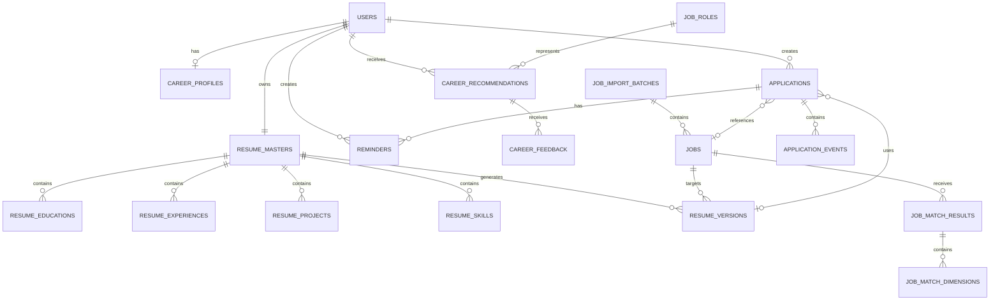

# 职航 CareerPilot P0 产品需求文档

**版本：** P0 / V0.1  
**产品定位：** AI 求职决策与求职过程管理平台  
**目标用户：** 应届生、社招求职者、转行人群、职业方向不明确的求职者

---

# 1. 产品概述

## 1.1 产品名称

中文名：**职航**

英文名：**CareerPilot**

含义：

- “职”代表职业与求职；
- “航”代表方向判断、路径规划与过程导航；
- 不局限于秋招、校招或某一年龄阶段。

GitHub Repository 建议命名：

`careerpilot`

---

# 2. 产品定位

职航不是招聘信息平台，而是位于招聘平台之后的：

> **个人求职决策与管理工具。**

传统招聘网站主要回答：

> 市场上有什么工作？

职航主要回答：

> 什么工作更适合我？

> 同一家公司这么多职位，我应该投哪个？

> 决定投递后，我的简历应该怎样针对性调整？

> 我已经投了哪些职位，现在分别进行到什么阶段？

完整产品链路：

```text
认识自己
↓
确定职业方向
↓
筛选目标职位
↓
优化针对性简历
↓
完成投递
↓
管理求职进度
```

---

# 3. P0 产品目标

P0 不追求覆盖完整招聘市场，而是验证四项核心用户价值。

## 3.1 职业探索

解决：

> “我不知道自己应该投什么岗位。”

通过：

```text
简历母版
+
求职偏好
+
AI职业分析
```

推荐 1–3 类具体职业方向。

---

## 3.2 职位决策

解决：

> “这家公司有几十个职位，我不知道哪个更适合自己。”

通过：

```text
招聘职位
+
个人简历
+
求职画像
↓
多维度匹配
↓
Top 5
```

帮助用户缩小选择范围。

---

## 3.3 针对性简历优化

解决：

> “我决定投这个岗位了，但不知道简历应该突出什么。”

基于：

```text
简历母版
+
目标JD
```

生成针对职位优化后的简历版本。

---

## 3.4 求职过程管理

解决：

> “投递多了以后，不记得哪个职位进行到哪一步。”

通过：

- 投递记录；
- 动态流程 Timeline；
- Dashboard；
- 日程提醒；

统一管理求职过程。

---

# 4. P0 不做什么

为了控制项目复杂度，P0 暂不包含：

- 自动代用户投递；
- 全网职位聚合；
- 无限制支持任意招聘网站；
- 自动发送邮件/短信提醒；
- AI 自动进行面试；
- 招聘信息社区；
- 薪资预测；
- Offer 比较；
- AI Agent 自主求职；
- 自训练推荐模型；
- 自训练职位匹配模型。

P0 核心原则：

> 先证明 AI 求职决策是否真正有价值，再扩大自动化程度。

---

# 5. 目标用户

## Persona A：职业方向模糊

典型问题：

> 我学的专业不好找工作，不知道还能投什么。

> 我想转行，但不知道自己的经历能转什么方向。

对应功能：

**职业探索**

---

## Persona B：岗位选择困难

典型问题：

> 我想进腾讯，但官网有几十个岗位，不知道应该投哪几个。

对应功能：

**职位匹配**

---

## Persona C：简历不会针对岗位修改

典型问题：

> 我有一份基础简历，但不同岗位应该怎么调整？

对应功能：

**简历优化**

---

## Persona D：大量投递后管理混乱

典型问题：

> 我已经投了三十家公司，不记得哪些测评没做、哪些进入面试。

对应功能：

**投递管理 + Reminder**

---

# 6. 产品整体信息架构

```text
职航 CareerPilot
│
├── 首页 Dashboard
│
├── 我的简历
│   ├── 简历母版
│   └── 针对性简历
│
├── 职业探索
│   ├── 求职画像
│   ├── 职业推荐
│   └── 推荐反馈
│
├── 职位匹配
│   ├── 导入职位
│   ├── 匹配结果
│   ├── 职位详情
│   └── 简历优化
│
├── 投递管理
│   ├── 投递列表
│   └── 投递详情 / Timeline
│
└── 账号设置
```

顶部一级导航建议只有：

```text
首页
我的简历
职业探索
职位匹配
投递管理
```

避免导航过度复杂。

---

# 7. 核心用户流程

## 7.1 新用户首次进入

```text
注册
↓
创建简历母版
↓
是否填写求职偏好？
├─ 是 → 输入行业 / 岗位方向 / 城市等
└─ 否 → 跳过
↓
生成个人求职画像
↓
推荐1–3类岗位
```

---

## 7.2 职业探索

```text
简历母版
+
用户偏好
+
历史推荐反馈
↓
AI分析个人能力
↓
匹配职业类型库
↓
推荐1–3个细分岗位
↓
展示推荐理由
↓
用户 👍 / 👎
↓
保存反馈
↓
下一次推荐调整
```

---

## 7.3 公司岗位筛选

```text
输入公司招聘网址
↓
填写初筛条件
如：
城市：杭州
岗位方向：产品 / 运营
↓
系统尝试获取岗位
↓
职位标准化
↓
个人简历 × 每个JD
↓
结构化匹配评分
↓
Top 5
```

---

## 7.4 自动获取失败

必须提供降级方案：

```text
URL自动导入失败
↓
用户选择：

① 粘贴多个职位JD
② 手动添加单个职位
```

因此：

> 岗位获取失败不能导致职位匹配功能不可用。

---

## 7.5 简历优化

```text
Top 5职位
↓
用户选择目标职位
↓
点击“针对该职位优化简历”
↓
目标JD
+
简历母版
↓
AI优化
↓
用户预览
↓
人工修改
↓
保存
↓
生成目标岗位简历版本
```

---

## 7.6 完成真实投递后

```text
用户点击
“已投递”
↓
创建投递记录
↓
默认：
阶段 = 已投递
状态 = 进行中
```

---

## 7.7 后续更新

例如：

```text
9月1日  已投递
9月3日  在线测评
9月5日  简历筛选
9月8日  一面
9月12日 二面
9月15日 Offer
```

全部以 Timeline Event 形式保存。

---

# 8. 功能一：注册与登录

## 8.1 功能

支持：

- 邮箱注册；
- 密码登录；
- 登出；
- 保持登录状态；
- 修改基本信息。

P0 暂不需要：

- 微信登录；
- 手机验证码；
- Google 登录；
- 企业账号。

---

# 9. 功能二：简历母版

## 9.1 产品原则

简历不能只保存为 PDF 或一整段文本。

必须保存为：

> **结构化求职数据。**

---

# 10. 简历在线模板

参考常见招聘网站在线简历结构。

建议包含：

### 基本信息

- 姓名；
- 联系方式；
- 所在城市；
- 求职状态。

### 教育经历

- 学校；
- 学历；
- 专业；
- 起止日期；
- GPA；
- 主修课程；
- 补充说明。

### 工作 / 实习经历

- 公司；
- 职位；
- 起止日期；
- 工作职责；
- 工作成果。

### 项目经历

- 项目名称；
- 项目角色；
- 时间；
- 项目背景；
- 工作内容；
- 成果。

### 校园 / 社会经历

可选。

### 技能

例如：

- Excel；
- SQL；
- Python；
- Figma；
- Photoshop；
- AI 工具等。

### 证书 / 奖项

可选。

### 自我介绍

可选。

---

# 11. 简历库

页面结构：

```text
我的简历

⭐ 简历母版
最后修改：2026-09-07
[查看] [编辑]

针对性简历

腾讯 · 产品运营
来自：简历母版
创建于：2026-09-10
[查看] [编辑]

vivo · AI产品经理
创建于：2026-09-12
[查看] [编辑]
```

核心规则：

> 用户始终只有一份当前简历母版。

针对职位优化后：

> 创建 Resume Version。

不能覆盖母版。

---

# 12. 功能三：个人求职画像

## 12.1 输入

系统读取：

```text
简历母版
+
可选求职偏好
+
历史推荐反馈
```

求职偏好包括：

- 意向岗位；
- 意向行业；
- 意向城市；
- 是否接受转行。

全部允许跳过。

---

# 13. 求职画像结构

系统不应只生成一段 AI 文字。

应结构化形成：

### 经历画像

例如：

```text
互联网项目经验：中
数据分析经验：高
用户研究经验：中高
内容经验：中
```

### 能力画像

例如：

```text
数据分析       高
用户洞察       高
跨团队协作     高
项目管理       中
产品设计       中
销售能力       低
```

### 工具技能

结构化保存。

### 行业经验

结构化保存。

### 用户偏好

独立保存。

---

# 14. 职业推荐

系统推荐：

**1–3 个具体职位类型。**

例如用户输入：

> 想找运营。

系统可能推荐：

```text
① 产品运营

推荐理由：
已有产品协作、数据分析和流程优化经历。

② 用户运营

推荐理由：
用户研究与用户反馈分析能力较强。

③ AI产品经理

跨方向推荐：
虽然不属于传统运营，但AI工具使用经验和产品能力匹配度较高。
```

因此推荐允许出现两类结果：

### 意向方向内推荐

例如：

```text
运营
→
产品运营
```

### 跨方向机会发现

例如：

```text
运营意向
+
AI / 产品经历
→
AI产品经理
```

这是该功能的重要差异化价值。

---

# 15. 推荐方法

P0：

**不训练模型。**

采用：

```text
LLM
+
职业分类 Taxonomy
+
岗位能力模板
+
用户反馈
```

---

# 16. 职业 Taxonomy

后台建立标准化职业分类。

例如：

```text
产品
├── 用户产品
├── AI产品
├── 平台产品
├── 数据产品
└── 商业产品

运营
├── 用户运营
├── 产品运营
├── 内容运营
├── 活动运营
├── 商家运营
├── 社区运营
└── 策略运营

市场
├── 品牌
├── 增长
├── 市场策划
└── 商务
```

每一种职业包含标准能力标签。

例如：

```text
用户运营

用户洞察
数据分析
用户增长
活动设计
内容能力
沟通协调
```

---

# 17. 职业推荐评分思想

职业推荐建议区分：

### Ability Fit

> 用户具备什么能力？

### Preference Fit

> 用户想做什么？

### Transition Cost

> 用户进入这个领域需要补多少能力？

最终推荐不是单纯：

> 你最适合 X。

而应解释：

```text
能力匹配：高
兴趣匹配：中高
转型成本：低
```

用户未填写求职偏好时：

主要基于 Ability Fit。

---

# 18. 推荐反馈

每张职业推荐卡：

```text
👍 感兴趣

👎 不感兴趣
```

点击 👎 后允许选择原因：

- 工作内容没兴趣；
- 行业不喜欢；
- 地点不合适；
- 觉得自己不适合；
- 不希望转行；
- 其他。

重要原则：

> “不喜欢”不能被系统理解成“不具备能力”。

因此：

```text
Ability Fit
```

和：

```text
Preference Fit
```

必须分别建模。

P0 不需要机器学习。

下一次生成时：

把历史反馈作为 Context 输入推荐系统即可。

---

# 19. 功能四：公司职位匹配

这是职航 P0 的核心功能。

---

# 20. 岗位导入方式

页面：

```text
分析目标公司职位

公司招聘网址
[________________________]

城市
[杭州]

岗位方向
[产品、运营]

[开始分析]
```

字段采用文本输入，而不是固定选择。

原因：

不同招聘网站的岗位分类体系不同。

---

# 21. 岗位获取架构

使用多层策略。

```text
招聘网址
↓
① Source Adapter
↓失败
② 页面数据/API解析
↓失败
③ Browser Automation
↓失败
④ 用户手动导入
```

优先级：

```text
公开结构化接口
>
HTML解析
>
Playwright
>
手动输入
```

---

# 22. 不做万能爬虫

P0 不承诺：

> 支持所有招聘网站自动读取。

应显示：

```text
支持自动解析部分招聘网站。

若解析失败，可直接粘贴职位信息继续分析。
```

这样职位导入和职位匹配完全解耦。

---

# 23. 标准化职位结构

无论职位来自：

- URL；
- API；
- HTML；
- Playwright；
- 用户复制；

最终统一转换为：

```text
Job

公司
职位名称
地点
部门
职位类别
JD原文
岗位职责
任职要求
来源网址
```

后续 AI 匹配只读取标准化 Job。

---

# 24. 职位匹配核心原则

禁止：

```text
把简历 + JD 给AI
↓
AI直接回答：
“匹配度87%”
```

P0 采用：

> **固定 Rubric + AI判断 + 后端计算。**

---

# 25. 硬性条件 Gate

首先检查：

- 学历；
- 工作年限；
- 毕业年份；
- 专业强制要求；
- 语言要求；
- 证书要求；
- 地点条件；
- 其他明确 Must-have。

返回：

```text
PASS
WARN
FAIL
```

例如：

```text
⚠ 硬性条件存在风险

职位要求：
3年以上工作经验

用户经历：
1年

能力匹配度可能较高，
但总体不建议优先投递。
```

硬性条件不直接混进匹配总分。

---

# 26. 匹配评分模型

对通过 Gate 或处于 WARN 的职位计算：

| 维度 | 权重 |
|---|---:|
| 经历匹配 | 30 |
| 核心能力 | 25 |
| 技能 / 工具 | 15 |
| 教育 / 背景 | 10 |
| 行业 / 业务 | 10 |
| 用户偏好 | 10 |
| 总分 | 100 |

最终分数由：

**后端代码计算。**

不是 AI 自由生成。

---

# 27. AI 输出结构

AI 只负责每个维度判断：

```json
{
  "experience": {
    "score": 25,
    "max_score": 30,
    "reason": "具有较强的数据分析和流程优化经验",
    "evidence": [
      "梳理近三年需求数据并分析全流程耗时"
    ]
  }
}
```

总分：

```text
Backend
↓
sum(dimension scores)
↓
84
```

---

# 28. Evidence 原则

所有 AI 判断尽量采用：

```text
判断
+
证据
```

例如：

> 数据分析能力匹配：高

必须附：

> 简历证据：“负责近三年需求数据分析并搭建数据看板。”

避免 AI 仅凭印象评分。

---

# 29. Top 5 展示

职位较多时默认只展示：

**Top 5**

例如：

| 排名 | 职位 | 匹配度 | 条件 | 建议 |
|---|---|---:|---|---|
| 1 | 产品运营 | 91 | PASS | 强推荐 |
| 2 | AI产品经理 | 87 | PASS | 推荐 |
| 3 | 用户运营 | 82 | PASS | 推荐 |
| 4 | 内容产品 | 79 | WARN | 可考虑 |
| 5 | 商业运营 | 74 | PASS | 一般 |

点击职位进入详情。

---

# 30. 职位详情

展示：

### 匹配总分

```text
87 / 100
```

### 硬性条件

```text
PASS
```

### 分项评分

```text
经历        27/30
核心能力    22/25
技能        12/15
教育         8/10
行业         9/10
偏好         9/10
```

### 优势

### 差距

### 简历证据

### JD核心要求

### 投递建议

### 针对性提升方向

底部：

**[针对该职位优化简历]**

---

# 31. AI 是否需要训练

P0：

**不训练。**

使用：

```text
Prompt / Skill
+
固定评分标准
+
Structured Output
+
Eval
```

优先优化：

- Prompt；
- Score Rubric；
- 职位分类；
- Evidence；
- 测试集。

后续拥有真实用户数据后，再考虑排序模型或机器学习。

---

# 32. Eval 机制

上线前建立内部测试集。

例如：

```text
30份简历
×
10组职位
```

人工建立：

```text
人工Top 5
```

然后与系统：

```text
AI Top 5
```

比较。

核心不是要求：

> 评分绝对准确。

而是重点验证：

> 排序是否合理？

长期重点指标可考虑：

```text
Top-1一致率
Top-3 Recall
排序相关性
```

---

# 33. 功能五：针对性简历优化

输入：

```text
Resume Master
+
Target Job
```

输出：

```text
Resume Version
```

---

# 34. 简历优化原则

不能修改：

- 姓名；
- 联系方式；
- 教育真实性；
- 学校；
- 学位；
- 时间；
- 真实工作单位。

主要允许优化：

- 实习经历；
- 工作经历；
- 项目经历；
- 校园经历；
- 技能描述；
- 自我介绍。

---

# 35. AI真实性约束

核心原则：

> **只能强化已有事实，禁止创造经历。**

允许：

- 调整信息顺序；
- 优化表达；
- 强化与JD相关能力；
- 删除无关信息；
- 提醒可量化信息；
- 重新组织 STAR 表达。

禁止：

- 虚构技能；
- 虚构数字；
- 虚构项目；
- 虚构岗位职责；
- 虚构工作成果。

---

# 36. 缺失能力处理

例如 JD 要求：

```text
SQL
```

但用户没有填写 SQL。

系统不能修改成：

```text
熟练使用 SQL
```

应显示：

```text
能力差距：

目标岗位多次强调 SQL，
当前简历未发现相关经历。

建议：
若真实掌握，可补充相关项目；
若尚未掌握，可作为后续提升方向。
```

---

# 37. 功能六：投递管理

职位完成投递后，可以：

```text
[添加到投递管理]
```

或者用户手动创建。

字段：

- 公司；
- 职位；
- 职位链接；
- 投递日期；
- 备注。

---

# 38. 投递状态设计

投递管理必须区分：

## Current Stage

当前进行到哪里。

例如：

```text
已投递
简历筛选
测评
笔试
AI面
面试
Offer
```

---

## Process Status

整个流程结果：

```text
ACTIVE
REJECTED
OFFER
WITHDRAWN
```

对应：

```text
进行中
流程终止
已获Offer
主动放弃
```

---

# 39. 为什么这样设计

例如：

```text
current_stage = interview
round = 1

process_status = REJECTED
```

前端：

> 一面淘汰

---

另一个：

```text
current_stage = resume_screen

process_status = REJECTED
```

前端：

> 简历筛选淘汰

不需要创建几十个：

```text
一面挂
二面挂
AI面挂
测评挂
```

状态。

---

# 40. 不固定招聘流程

采用：

**Event Timeline**

而不是固定 Pipeline。

例如：

```text
公司A

投递
↓
简历筛选
↓
测评
↓
一面
```

公司B：

```text
投递
↓
测评
↓
AI面
↓
简历筛选
↓
一面
```

都可以支持。

---

# 41. Application Event

每一个招聘动作保存成 Event：

```text
event_type

application
resume_screen
assessment
written_test
ai_interview
interview
offer
other
```

允许用户：

**新增自定义节点。**

例如：

```text
HR沟通
业务测验
案例分析
Boss面
```

因此不同企业流程都能覆盖。

---

# 42. 面试轮次

面试 Event 使用：

```text
round = 1
round = 2
round = 3
```

因此不预设最多几轮。

---

# 43. 投递详情页面

例如：

```text
腾讯
产品运营

当前：
二面

状态：
进行中
```

Timeline：

```text
● 09-01 已投递

● 09-03 在线测评
  已完成

● 09-06 一面
  已通过

● 09-10 二面
  14:00
```

用户可：

- 添加节点；
- 修改节点；
- 删除节点；
- 更新流程结果。

---

# 44. 功能七：首页 Dashboard

用户已明确 P0 首页只呈现：

1. 总览；
2. 投递漏斗；
3. Reminder。

不增加推荐岗位、AI分析等其他模块。

---

# 45. 首页模块一：总览

例如：

```text
累计投递      42

进行中        15

流程终止      22

Offer          2

主动放弃       3
```

---

# 46. 首页模块二：投递漏斗

由于不同公司招聘流程不一致，不应该使用：

```text
投递
↓
测评
↓
笔试
↓
面试
```

这种强制流程。

推荐使用抽象 Milestone：

```text
累计投递
42
↓
进入后续评估
26
↓
进入真人面试
10
↓
Offer
2
```

定义：

### 累计投递

创建 Application。

### 进入后续评估

发生过以下任一 Event：

```text
assessment
written_test
ai_interview
resume_screen_pass
interview
```

### 进入真人面试

发生：

```text
interview
```

### Offer

发生：

```text
offer
```

这是一条统计漏斗，而不是公司真实流程。

---

# 47. 首页模块三：提醒

例如：

```text
即将到期

今天

腾讯 · 产品运营
在线测评
23:59

────────

明天

京东 · 产品运营
一面
14:00

────────

9月12日

网易 · 用户运营
笔试
19:00
```

---

# 48. Reminder

用户手动创建：

- 任务名称；
- 关联职位；
- 类型；
- 截止时间；
- 备注。

类型：

```text
测评
笔试
AI面
面试
材料提交
其他
```

P0：

只在站内 Dashboard 展示。

暂不需要真正：

- 邮件提醒；
- 手机 Push；
- 短信。

---

# 49. 页面信息架构

## 49.1 Public

```text
/
Landing Page

/login
登录

/register
注册
```

---

## 49.2 Dashboard

```text
/dashboard
```

内容：

```text
Overview
Application Funnel
Upcoming Reminders
```

---

## 49.3 简历

```text
/resumes
```

简历库。

```text
/resumes/master
```

简历母版。

```text
/resumes/master/edit
```

编辑母版。

```text
/resumes/:resumeVersionId
```

针对性简历。

---

## 49.4 职业探索

```text
/career
```

求职画像 + 推荐入口。

```text
/career/profile
```

详细求职画像。

```text
/career/recommendations
```

职业推荐结果。

---

## 49.5 职位匹配

```text
/job-match
```

职位导入。

```text
/job-match/:batchId
```

Top 5结果。

```text
/jobs/:jobId
```

职位详情 + 匹配分析。

```text
/jobs/:jobId/resume-tailor
```

简历优化。

---

## 49.6 投递管理

```text
/applications
```

投递列表。

```text
/applications/:applicationId
```

投递详情 + Timeline。

---

# 50. 页面主导航

```text
[Logo 职航]

首页

我的简历

职业探索

职位匹配

投递管理

                    用户头像
```

---

# 51. 数据库 ER 模型

推荐采用：

**PostgreSQL**

核心 ER：



---

# 52. USERS

```text
id
email
password_hash
name
created_at
updated_at
```

---

# 53. RESUME_MASTERS

```text
id
user_id
summary
updated_at
```

每个用户：

```text
1 User
:
1 Resume Master
```

---

# 54. RESUME_EDUCATIONS

```text
id
resume_master_id
school
degree
major
start_date
end_date
gpa
courses
description
```

---

# 55. RESUME_EXPERIENCES

统一处理：

- 工作；
- 实习；
- 校园经历。

```text
id
resume_master_id
experience_type
organization
position
start_date
end_date
description
achievements
```

---

# 56. RESUME_PROJECTS

```text
id
resume_master_id
name
role
start_date
end_date
background
description
achievements
```

---

# 57. RESUME_SKILLS

```text
id
resume_master_id
skill_name
skill_category
proficiency
```

---

# 58. CAREER_PROFILES

保存 AI 提取后的结构化画像。

```text
id
user_id
ability_profile JSONB
industry_profile JSONB
experience_profile JSONB
preferences JSONB
generated_at
updated_at
```

---

# 59. JOB_ROLES

系统职业 Taxonomy。

```text
id
category
role_name
description
ability_requirements JSONB
industry_tags JSONB
```

例如：

```text
category = 运营
role_name = 用户运营
```

---

# 60. CAREER_RECOMMENDATIONS

```text
id
user_id
job_role_id
ability_fit
preference_fit
transition_cost
reason
evidence JSONB
created_at
```

---

# 61. CAREER_FEEDBACK

```text
id
recommendation_id
user_id
feedback_type
reason
comment
created_at
```

其中：

```text
feedback_type

LIKE
DISLIKE
```

---

# 62. JOB_IMPORT_BATCHES

表示一次：

> 分析某公司职位

行为。

```text
id
user_id
company_name
source_url
city_filter
category_filter
import_method
status
created_at
```

---

# 63. JOBS

```text
id
batch_id
company_name
title
department
location
category
source_url
raw_jd
responsibilities
requirements
created_at
```

---

# 64. JOB_MATCH_RESULTS

```text
id
user_id
job_id
resume_master_id

eligibility_status
total_score
recommendation

strengths JSONB
gaps JSONB

created_at
```

---

# 65. JOB_MATCH_DIMENSIONS

```text
id
match_result_id
dimension
score
max_score
reason
evidence JSONB
```

例如：

```text
dimension = experience
score = 27
max_score = 30
```

---

# 66. RESUME_VERSIONS

```text
id
user_id
resume_master_id
job_id
name
content JSONB
ai_generated
created_at
updated_at
```

---

# 67. APPLICATIONS

```text
id
user_id
job_id
resume_version_id

company_name
job_title
job_url

applied_at

current_stage
current_round

process_status

note

created_at
updated_at
```

process_status：

```text
ACTIVE
REJECTED
OFFER
WITHDRAWN
```

---

# 68. APPLICATION_EVENTS

```text
id
application_id

event_type
custom_event_name

round_no

occurred_at
deadline

outcome
note

created_at
```

event_type：

```text
APPLICATION
RESUME_SCREEN
ASSESSMENT
WRITTEN_TEST
AI_INTERVIEW
INTERVIEW
OFFER
OTHER
```

---

# 69. REMINDERS

```text
id
user_id
application_id

title
reminder_type

deadline
completed

note

created_at
```

---

# 70. P0 API 设计

统一前缀：

```text
/api/v1
```

---

# 71. Authentication API

| Method | Endpoint | 功能 |
|---|---|---|
| POST | `/auth/register` | 注册 |
| POST | `/auth/login` | 登录 |
| POST | `/auth/logout` | 登出 |
| GET | `/auth/me` | 当前用户 |

---

# 72. Resume API

| Method | Endpoint | 功能 |
|---|---|---|
| GET | `/resume/master` | 获取简历母版 |
| POST | `/resume/master` | 创建母版 |
| PUT | `/resume/master` | 更新母版 |
| GET | `/resume/versions` | 获取针对性简历列表 |
| GET | `/resume/versions/{id}` | 查看一个版本 |
| PUT | `/resume/versions/{id}` | 编辑版本 |
| DELETE | `/resume/versions/{id}` | 删除版本 |

---

# 73. Career Profile API

| Method | Endpoint | 功能 |
|---|---|---|
| POST | `/career/profile/generate` | 生成求职画像 |
| GET | `/career/profile` | 获取画像 |
| PUT | `/career/preferences` | 修改求职偏好 |

---

# 74. Career Recommendation API

| Method | Endpoint | 功能 |
|---|---|---|
| POST | `/career/recommendations/generate` | 推荐职位类型 |
| GET | `/career/recommendations` | 查看推荐 |
| POST | `/career/recommendations/{id}/feedback` | 点赞/踩 |

---

# 75. Job Import API

| Method | Endpoint | 功能 |
|---|---|---|
| POST | `/job-import/url` | URL导入 |
| POST | `/job-import/text` | 文本批量导入 |
| POST | `/job-import/manual` | 手动添加单岗位 |
| GET | `/job-import/{batchId}` | 查看导入状态 |
| GET | `/job-import/{batchId}/jobs` | 查看岗位 |

---

# 76. Job Matching API

| Method | Endpoint | 功能 |
|---|---|---|
| POST | `/job-match/{batchId}` | 批量计算 |
| GET | `/job-match/{batchId}` | Top 5 |
| GET | `/jobs/{jobId}` | 职位详情 |
| GET | `/jobs/{jobId}/match` | 匹配详情 |

---

# 77. Resume Tailoring API

| Method | Endpoint | 功能 |
|---|---|---|
| POST | `/jobs/{jobId}/resume-tailor` | AI优化简历 |
| POST | `/resume/versions/{id}/save` | 保存版本 |

推荐实际实现时：

`resume-tailor`

返回：

```text
draft
```

只有用户确认后再：

```text
save
```

避免 AI 自动覆盖内容。

---

# 78. Application API

| Method | Endpoint | 功能 |
|---|---|---|
| POST | `/applications` | 创建投递 |
| GET | `/applications` | 投递列表 |
| GET | `/applications/{id}` | 投递详情 |
| PUT | `/applications/{id}` | 编辑投递 |
| DELETE | `/applications/{id}` | 删除 |
| PUT | `/applications/{id}/status` | 更新流程状态 |

---

# 79. Application Event API

| Method | Endpoint | 功能 |
|---|---|---|
| POST | `/applications/{id}/events` | 添加节点 |
| GET | `/applications/{id}/events` | Timeline |
| PUT | `/application-events/{eventId}` | 修改节点 |
| DELETE | `/application-events/{eventId}` | 删除节点 |

---

# 80. Reminder API

| Method | Endpoint | 功能 |
|---|---|---|
| POST | `/reminders` | 创建提醒 |
| GET | `/reminders` | 获取提醒 |
| PUT | `/reminders/{id}` | 修改 |
| DELETE | `/reminders/{id}` | 删除 |
| PATCH | `/reminders/{id}/complete` | 标记完成 |

---

# 81. Dashboard API

尽量不要首页调用大量小 API。

建议提供一个聚合接口：

```text
GET /dashboard
```

返回：

```json
{
  "overview": {
    "total": 42,
    "active": 15,
    "rejected": 22,
    "offer": 2,
    "withdrawn": 3
  },

  "funnel": {
    "applications": 42,
    "advanced": 26,
    "interviews": 10,
    "offers": 2
  },

  "reminders": []
}
```

这样首页一次请求即可加载。

---

# 82. AI Service 架构

建议不要在 API Controller 中直接写 Prompt。

独立：

```text
backend/
└── services/
    └── ai/
        ├── profile/
        ├── career_recommend/
        ├── job_parser/
        ├── job_match/
        └── resume_tailor/
```

对应五个 AI Skill：

```text
Skill 1
Resume / Career Profile Extractor

Skill 2
Career Role Recommender

Skill 3
Job Description Parser

Skill 4
Resume-Job Matcher

Skill 5
Resume Tailor
```

---

# 83. AI 统一流程

建议统一成：

```text
Input
↓
Context Builder
↓
Skill
↓
LLM
↓
Structured JSON
↓
Validation
↓
Business Logic
↓
Database
```

不要：

```text
页面A写一个Prompt
页面B再写一个Prompt
页面C又写一个Prompt
```

否则后期很难维护。

---

# 84. 推荐系统 P0 架构

```text
Resume Master
↓
Profile Extractor
↓
Career Profile
       +
Preferences
       +
Feedback
       +
Job Taxonomy
↓
Career Recommendation Skill
↓
Top 1–3
```

不需要 Agent。

---

# 85. 职位匹配 P0 架构

```text
Job
+
Resume Master
↓
Job Matcher Skill
↓
Structured Scores
↓
Backend Validation
↓
Backend加总
↓
Ranking
↓
Top 5
```

---

# 86. 简历优化 P0 架构

```text
Target JD
+
Resume Master
↓
Resume Tailor
↓
Truth Constraint
↓
Draft
↓
User Review
↓
Save Resume Version
```

---

# 87. Job Import Service

目录建议：

```text
services/
└── job_import/
    ├── importer.py
    ├── html_parser.py
    ├── browser.py
    └── adapters/
```

其中：

```text
adapters/
```

可以逐渐添加特定招聘平台适配。

例如：

```text
moka_adapter.py
company_x_adapter.py
```

P0 不要求一次覆盖全部网站。

---

# 88. 推荐技术架构

对于该项目推荐：

```text
Frontend
Next.js
+
TypeScript

↓

Backend
FastAPI
+
Python

↓

Database
PostgreSQL

↓

AI Provider
OpenAI / Gemini / Claude
```

职位抓取：

```text
Requests
BeautifulSoup
Playwright
```

---

# 89. 推荐项目结构

```text
careerpilot/
│
├── frontend/
│   ├── src/
│   ├── components/
│   ├── pages/
│   └── package.json
│
├── backend/
│   ├── app/
│   │   ├── api/
│   │   ├── models/
│   │   ├── schemas/
│   │   ├── services/
│   │   │
│   │   ├── ai/
│   │   └── job_import/
│   │
│   └── requirements.txt
│
├── database/
│   └── migrations/
│
├── tests/
│
├── docs/
│   ├── PRD.md
│   ├── architecture.md
│   ├── database.md
│   └── api.md
│
├── .env.example
├── .gitignore
├── README.md
├── LICENSE
└── docker-compose.yml
```

---

# 90. 数据安全要求

由于简历包含大量个人信息，P0 就应该考虑基本安全。

至少做到：

### 密码

禁止明文存储。

### API Key

只存在服务器环境变量。

禁止：

```text
上传GitHub
```

### `.env`

加入：

```text
.gitignore
```

同时 GitHub 提供：

```text
.env.example
```

### 数据隔离

所有 Resume、Application 等 API：

必须验证：

```text
resource.user_id
==
current_user.id
```

用户 A 不能读取用户 B 数据。

---

# 91. AI隐私原则

发给第三方 AI API 时：

职位匹配一般不需要：

- 姓名；
- 手机号；
- 邮箱；
- 身份证；
- 精确地址。

建议在：

```text
AI Context Builder
```

阶段自动删除这些个人身份字段。

AI 只读取：

```text
教育
经历
项目
技能
职业偏好
```

---

# 92. P0 核心指标

现阶段不需要复杂商业指标。

主要验证：

### Activation

用户是否成功：

```text
创建简历母版
```

### Career Exploration

```text
职业推荐生成率

推荐点赞率
```

### Job Matching

```text
职位匹配使用次数

Top5 → 查看详情率

Top5 → 简历优化率
```

### Resume Tailoring

```text
生成后保存率
```

### Application Management

```text
添加投递率

投递记录持续更新率
```

---

# 93. P0 核心价值指标

如果只能选择一个核心指标：

> **每周完成有效求职决策的职位数量。**

有效求职决策可定义为用户对一个职位完成：

```text
分析
+
明确决策
```

例如：

- 保存；
- 投递；
- 放弃。

---

# 94. 开发优先级

不要严格按照页面顺序开发。

推荐：

## Sprint 1

```text
注册 / 登录
+
PostgreSQL
+
用户系统
```

## Sprint 2

```text
简历母版
+
简历库
```

## Sprint 3

```text
JD手动输入
+
Job Parser
+
职位匹配
```

到这里已经产生第一个核心闭环：

```text
Resume
+
JD
↓
匹配决策
```

---

## Sprint 4

```text
针对性简历优化
+
Resume Version
```

---

## Sprint 5

```text
个人求职画像
+
职业类型推荐
+
点赞 / 踩
```

---

## Sprint 6

```text
投递管理
+
Timeline
+
Reminder
+
Dashboard
```

---

## Sprint 7

最后开发：

```text
URL自动导入
+
HTML Parser
+
API Adapter
+
Playwright
```

这是刻意放到最后。

因为：

> 爬虫是技术手段，不是产品核心价值。

---

# 95. P0 完成标准

只有当以下完整链路可以真正跑通，P0 才算完成：

```text
注册
↓
填写简历母版
↓
获得职业推荐
↓
导入公司职位
↓
查看Top 5
↓
选择目标职位
↓
生成针对性简历
↓
保存简历
↓
创建投递
↓
记录招聘进展
↓
Dashboard查看整体求职状态
```

---

# 96. P0 产品一句话定义

> **职航 CareerPilot 是一个基于个人简历与求职偏好，帮助求职者发现适合的职业方向、筛选目标公司的高匹配职位、生成针对性简历，并持续管理整个求职流程的 AI 求职决策平台。**

---

# 97. 产品长期演进方向

P0：

```text
AI辅助决策
```

↓

P1：

```text
个性化求职助手
```

↓

P2：

```text
基于真实反馈的推荐排序
```

↓

长期：

```text
个人职业决策系统
```

未来系统不仅知道：

> 用户投了什么。

还逐渐能够理解：

```text
用户擅长什么
+
用户喜欢什么
+
什么职位愿意给用户机会
+
什么策略能提高用户成功率
```

这才是 CareerPilot 相比普通职位收藏工具真正长期有价值的方向。